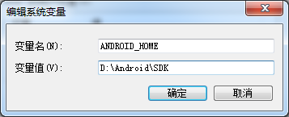
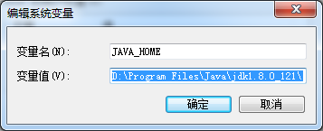
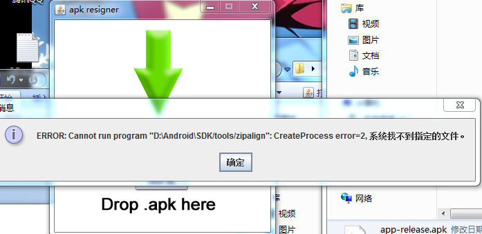
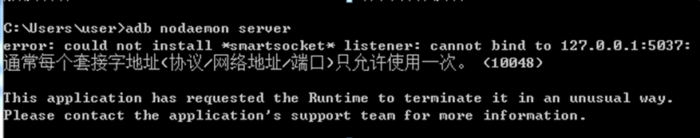

# 自动化测试前的一些环境配置及一些常用命令

## 关于Android SDK 配置
为了方便的在cmd窗口中执行adb命令，需要在系统环境变量中配置Android SDK的目录

1、新建ANDROID_HOME




然后在系统环境变量(path)中配置

``` java
 %ANDROID_HOME%\platform-tools
```
然后在cmd窗口中输入adb进行验证

## 关于JDK 配置
方便在cmd窗口中执行java命令,需要在系统环境变量中配置jdk

1、新建JAVA_HOME



然后在系统环境变量(path)中配置

``` java
 %JAVA_HOME%\bin
```
然后在cmd窗口中输入 javac -version 进行验证

## 关于re-sign.jar

re-sign.jar是一个可执行的jar文件，它的功能就是对apk进行重签名,它所使用的签名文件是Android Studio默认生成的，一般在
用户的user目录下的.android文件夹下（如windows下:C:\Users\user\.android）,文件名为debug.keystore.

关于re-sign.jar的原理：
```
jarsigner -sigalg MD5withRSA -digestalg SHA1 -keystore C:\Users\user\.android\debug.keystore -storepass android -keypass android -signedjar  C:\Users\
user\Desktop\temp.apk C:\Users\user\Desktop\source_debug.apk androiddebugkey

zipalign -f 4  C:/Users/user/Desktop/temp.apk C:/Users/user/Desktop/source_debug.apk
```

 备注：

```
jarsigner（jarsigner工具，在JDK的bin目录下）

C:\Users\user\.android\debug.keystore（android的debug.keystore路径）

C:\Users\user\Desktop\temp.apk（重签名后生成的临时文件，不是最终文件)

C:\Users\user\Desktop\source_debug.apk（要被重签名的apk文件路径）
```

所以,使用re-sign.jar之前需要配置JDK,一般会碰到的问题：




需要在ANDROID_HOME\tools目录下放入zipalign.exe文件


## 常用的Android SDK相关的命令

aapt 即Android Asset Packaging Tool，在SDK的build-tools目录下
1、查看apk包的packageName、versionCode、applicationLabel、launcherActivity、permission等各种详细信息
```
aapt dump badging filename.apk
```
2、查看apk包使用的权限
```
aapt dump permissions filename.apk
```


adb 全称 Android Debug Bridge ，是Android SDK自带的命令行工具，存在于ANDROID_HOME\platform-tools 文件夹下

1、 显示当前运行的全部模拟器(包括实体机)
```
adb devices
```

2、安装apk文件到手机
```
adb install filename.apk

若连接多个模拟器，则指定想要安装的模拟器，命令：

adb install -s device_name filename.apk  (device_name 通过adb devices 命令查询获得)

```
3、卸载手机上的apk文件
```
adb uninstall filename.apk
```
4、列出手机装的所有app的包名：
```
adb shell pm list packages

使用 grep 来过滤：
adb shell pm list packages | grep qq
```
5、列出除了系统应用的第三方应用包名（好用）：
```
adb shell pm list packages -3
```
6、清除应用数据与缓存
```
adb shell pm clear <packagename>
```
7、启动应用
```	
adb shell am start -n com.stormzhang.demo/.ui.SplashActivity
```
8、强制停止应用
```	
adb shell am force-stop <packagename>
```	

通过adb命令获取手机的一些信息

获取序列号
```
adb get-serialno
02ae0c1021089daf
```

获取 MAC 地址

```
adb shell  cat /sys/class/net/wlan0/address
bc:f5:ac:f9:f7:c8
```

查看设备型号
```
adb shell getprop ro.product.model
Nexus 5
```

查看 Android 系统版本
```
$adb shell getprop ro.build.version.release
7.0.1
```

查看屏幕分辨率
```
adb shell wm size
Physical size: 1080×1920
```

查看屏幕密度
```
adb shell wm density
Physical density: 480
```

## 若adb命令启动不了怎么办
电脑上如果装有一些应用市场的软件，很容易导致我们自己的adb命令服务不能正常启动，如图：


;


解决办法如下：

1、以下适用Windows 运命行下 ,具体查看被占用的端口进程
```
netstat -aon|findstr 5037
```
2、查看进程的具体描述（一般可跳过）
```
tasklist /fi "PID eq 5008"
```
5008为上步找到pid

3、强制退出进程
```
taskkill /pid 5008 /f
```
4、重新启动adb
```
adb start-server
```
关闭adb 重启
```
adb kill-server
adb start-server
```

## to be continued


	


	
	


