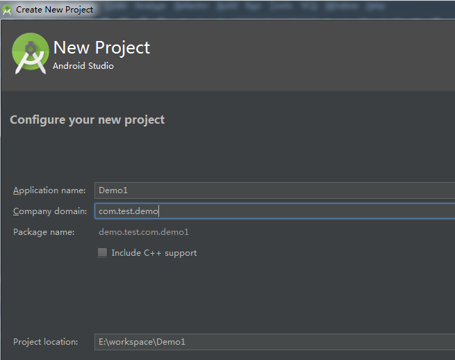
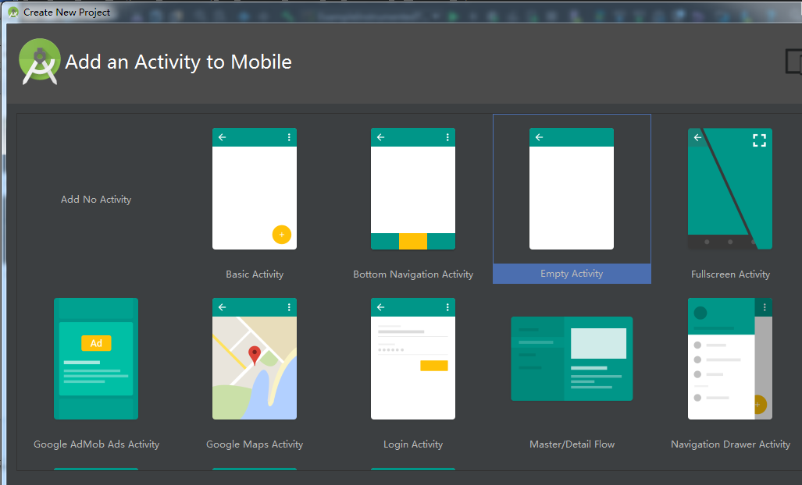
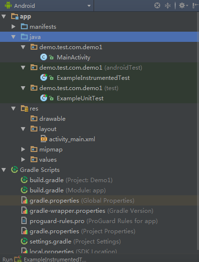
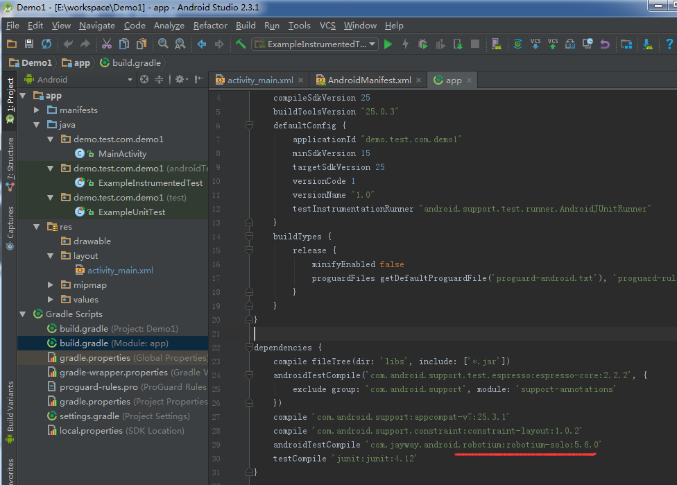
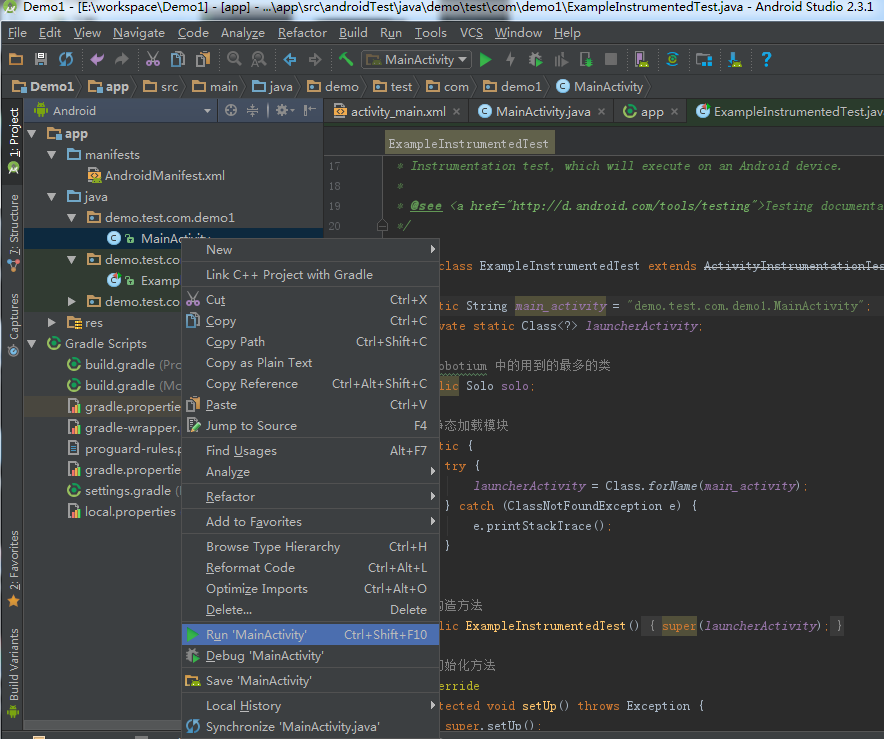
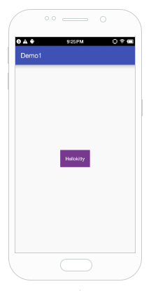
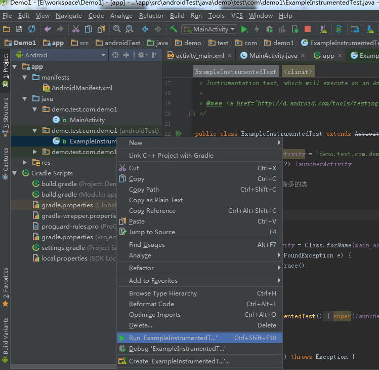
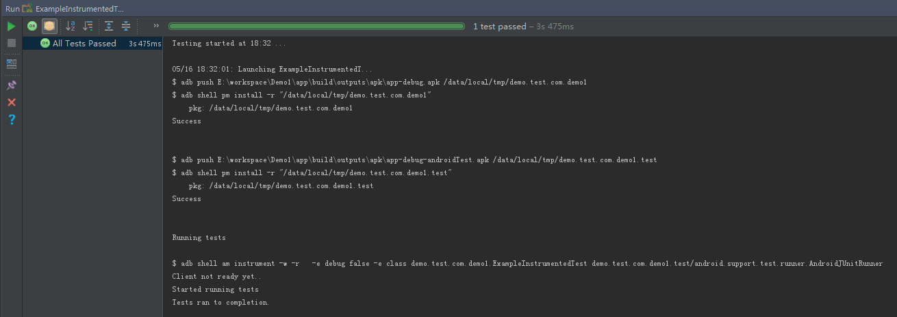

# Robotium (有源码)基于Android Studio 的自动化测试

## 开发工具
 目前Android官方开发工具是Android Studio（最新版本2.3.1） 基于Intellij IDE （[jetbrains](http://www.jetbrains.com/)公司产品）。使用Eclipse 结合Robotium做Android自动划测试，相比较AS而言，配置会简单很多。但是Eclipse + ADT的模式 google 已经不再做维护了。AS 作为google的官方开发工具，在功能上更加强大，编译速度更快。其次，AS上有很多便捷的插件，使得开发更加高效。综上，选择AS作为Android自动化测试的开发工具。
 
## 环境要求
- Java 开发工具包 (jdk-8u121-windows-x64) 
- [Android studio 2.3.1](http://www.android-studio.org/)
- Android SDK
- robotium-solo:5.6.0.jar

## 万年不变，第一个Hellokitty

首先使用AS 创建一个Android 工程如图：



下一步：



创建完成后的Android 工程：



在展开的包名中，能够看到一个ExampleInstrumentedTest类文件, 这个文件就是UI自动化测试的类 ，下面的(test)包名放的主要是单元测试的类
，我们可以看一下原生的ExampleInstrumentedTest 的内容：
``` java
@RunWith(AndroidJUnit4.class)
public class ExampleInstrumentedTest {
    @Test
    public void useAppContext() throws Exception {
        // Context of the app under test.
        Context appContext = InstrumentationRegistry.getTargetContext();

        assertEquals("demo.test.com.demo1", appContext.getPackageName());
    }
}
```
AS 2.3.1后默认使用的是JUnit4 ，我们使用的Robitium 测试框架不支持JUnit4,所以这个类文件后面我们会重新编辑。

## Android工程

我们可以先看一下默认创建的Android 类文件，MainActivity，这个类的功能就是在界面上显示一个text ，HelloKitty，点击这个HelloKitty,弹出一个toast，显示文本 '呵呵'。看一下MainActivity的内容：
``` java
public class MainActivity extends AppCompatActivity {
    TextView tv;//声明一个变量 tv
    @Override
    protected void onCreate(Bundle savedInstanceState) {
        super.onCreate(savedInstanceState);
        setContentView(R.layout.activity_main);
        //实例化tv
        tv = (TextView)findViewById(R.id.tv);
        //给tv设置点击事件
        tv.setOnClickListener(new View.OnClickListener(){
            @Override
            public void onClick(View v) {
                //弹出toast显示文本'呵呵'
                Toast.makeText(MainActivity.this,"呵呵",Toast.LENGTH_LONG).show();
            }
        });

    }
}
```
然后再看一下 R.layout.activity_main 这个布局文件中的内容
``` java
<?xml version="1.0" encoding="utf-8"?>
<RelativeLayout xmlns:android="http://schemas.android.com/apk/res/android"
    android:layout_width="match_parent"
    android:layout_height="match_parent"
     >


    <TextView
        android:id="@+id/tv"
        android:layout_width="wrap_content"
        android:layout_height="wrap_content"
        android:background="#783890"
        android:padding="16dp"
        android:layout_centerInParent="true"
        android:text="Hellokitty"
        android:textColor="@android:color/white"
        />

</RelativeLayout>

```

## 编辑gradle文件
 由于我们使用robotium作为自动化测试的框架，所以需要导入robotium的jar包。在eclipse中，我们都是通过把jar下载下来，然后通过build path 引入jar文件，在AS中，使用gradle的方式，如图：
 

 
 ``` 
  androidTestCompile 'com.jayway.android.robotium:robotium-solo:5.6.0'
 ```
 通过这种方式，就把robotium的jar包下载下来了，接下来编写测试文件，就是之前提到的 ExampleInstrumentedTest类文件
 
 # 编写基于Robotium的测试文件
 
 之前说过，Robotium不支持JUnit4，所以默认生成的ExampleInstrumentedTest文件不符我们的要求，我们需要编写自己的UI自动化测试文件，如下：
 ``` java
 public class ExampleInstrumentedTest extends ActivityInstrumentationTestCase2 {

    static String main_activity = "demo.test.com.demo1.MainActivity";
    private static Class<?> launcherActivity;

    //Robotium 中的用到的最多的类
    public Solo solo;

    //静态加载模块
    static {
        try {
            launcherActivity = Class.forName(main_activity);
        } catch (ClassNotFoundException e) {
            e.printStackTrace();
        }
    }

    //构造方法
    public ExampleInstrumentedTest() {
        super(launcherActivity);
    }

    //初始化方法
    @Override
    protected void setUp() throws Exception {
        super.setUp();
        solo = new Solo(getInstrumentation(), getActivity());
    }

    //销毁资源的方法
    @Override
    protected void tearDown() throws Exception {
        solo.finishOpenedActivities();
    }

    /**
     * 测试用例，点击text 弹出toast
     */
    public void test01_clickText(){
        TextView tv = (TextView)solo.getView("tv");
        //判断tv是否为空
        assertTrue("tv为null",null != tv);
        //点击tv
        solo.clickOnView(tv);
        //捕获toast
        TextView toast = (TextView) solo.getView("message");
        //toast
        assertTrue("toast 为空",null != toast);
        assertTrue("弹出toast失败",solo.searchText(toast.getText().toString()));
    }

}
```
## 运行我们的第一个自动化测试
在运行测试用例前，我们先把自己写的第一个安卓应用安装到手机上（其实就是展示MainActivity.java中的内容,显示一个text，可以响应点击事件，弹出toast），如下：
 
 
我们的apk在手机上的显示如下：


现在运行自动化测试用例，如图：


测试用例执行结果：


## 结束
这是自动化测试中最简单的一课，基于有源码的情况下，做一个简单的自动化测试。下一讲针对没有源码的情况下 如何通过robotium做自动化测试，see you 


 

 
 
 
 


