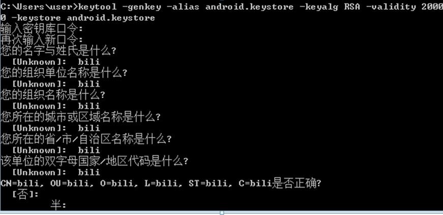
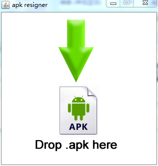
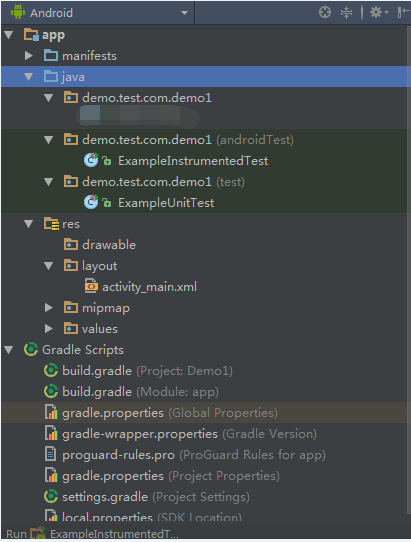
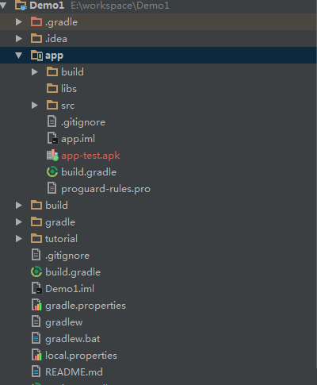
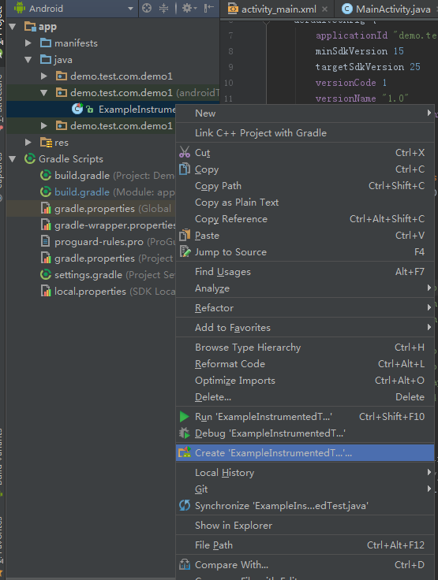
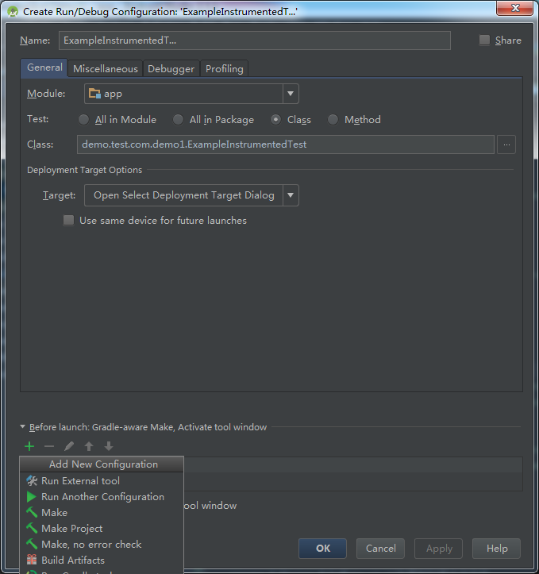
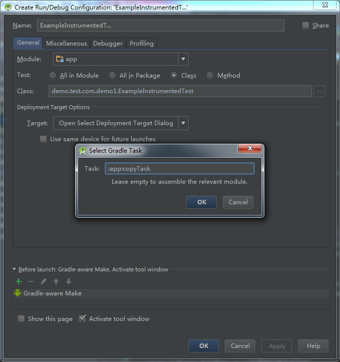
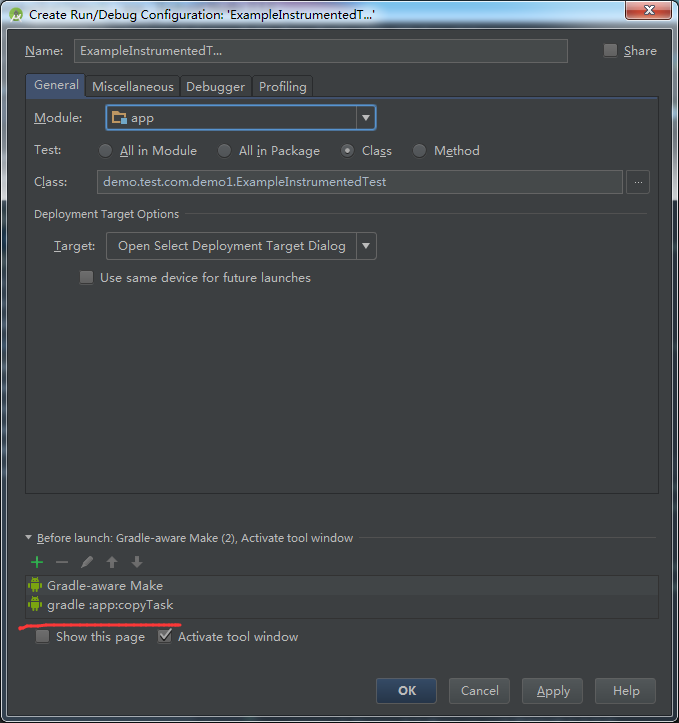

# Robotium (无源码)基于Android Studio 的自动化测试

之前的文章介绍了Robotium基于无源码情况下的自动化测试，但是大部分情况下，我们都是没有源码的，只有apk文件，实际中无源码的测试场景更多，所以今天来讲一讲Robotium的无源码测试。

## 工具要求

- 一个重签名工具re-sign.jar 
- 生成一个自己默认的android.keystore文件

## 生成android.keystore文件
如图：


命令：

``` java
keytool -genkey -alias android.keystore -keyalg RSA -validity 20000 -keystore android.keystore
```

## 使用re-sign.jar 对被测app进行重签名
双击 re-sign.jar




 

签名完成会得到一个Package name 和一个 Main activity，这两个字符串在我们做自动化测试的时候会用到

接下来开始无源码下的自动化测试

# 创建一个Android 工程





到此一个android工程就创建好了

# 切换Android 工程目录到 Project试图下





把被测 app 拷贝到app/目录下，如图：

## 编辑build.gradle文件

``` java
apply plugin: 'com.android.application'

android {
    compileSdkVersion 25
    buildToolsVersion "25.0.3"
    defaultConfig {
        applicationId "tv.danmaku.bili"
        minSdkVersion 18
        targetSdkVersion 25
        versionCode 1
        versionName "1.0"
        testInstrumentationRunner "android.support.test.runner.AndroidJUnitRunner"
    }
    buildTypes {
//        release {
//            minifyEnabled false
////            signingConfig signingConfigs.config
//            proguardFiles getDefaultProguardFile('proguard-android.txt'), 'proguard-rules.pro'
//        }
        debug {
//            signingConfig signingConfigs.config
        }

    }
}

dependencies {
    compile fileTree(dir: 'libs', include: ['*.jar'])
    androidTestCompile('com.android.support.test.espresso:espresso-core:2.2.2', {
        exclude group: 'com.android.support', module: 'support-annotations'
    })
    compile 'com.android.support:appcompat-v7:25.3.1'
    testCompile 'junit:junit:4.12'
    androidTestCompile 'com.jayway.android.robotium:robotium-solo:5.6.0'
    androidTestCompile 'com.android.support.test.uiautomator:uiautomator-v18:2.1.0'
    compile 'com.android.support:recyclerview-v7:25.3.1'
}
task copyTask(type: Copy) {
    from 'app-release.apk'//将被测试apk放在工程app目录下
    into 'build/outputs/apk/'//将apk复制到指定目录
    rename { String fileName -> //在复制时重命名文件
        fileName = "app-debug.apk" // 重命名
    }
}

```
为什么要加一个task copyTask呢？ 参考[链接](http://blog.csdn.net/w306695293/article/details/55798688)

##  配置用例
 
 
 
 
 

## 运行自动化测试
如图：


测试用例执行结果：


## done


 

 
 
 
 


