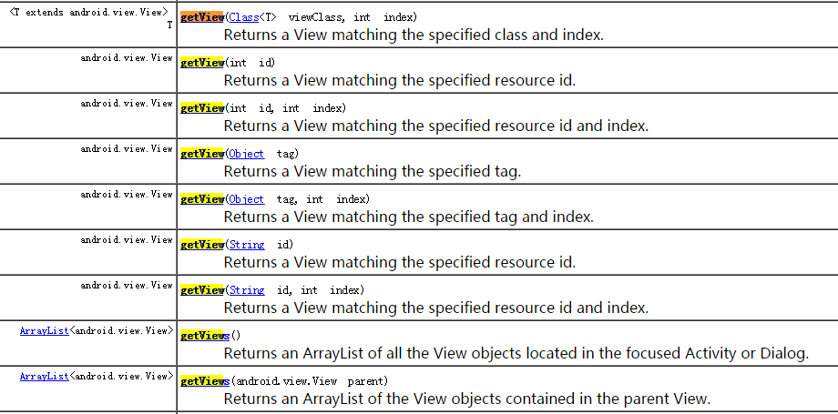

# Robotium  getView()方法

使用Robotium做自动化的测试,使用频率最高的就是Solo类，此类中我们最常用的方法就是getView()及该方法的重载，如图：



但我们最常用的还是通过 id（int类型） 或者id (String类型)来获取view对象，getView(String id)方法在Robotium中的源码如下：

``` java
	public View getView(String id){
		if(config.commandLogging){
			Log.d(config.commandLoggingTag, "getView(\""+id+"\")");
		}
		
		return getView(id, 0);
	}

```
跟进getView(id, 0)

``` java

	public View getView(String id, int index){
		if(config.commandLogging){
			Log.d(config.commandLoggingTag, "getView(\""+id+"\", "+index+")");
		}
		
		View viewToReturn = getter.getView(id, index);

		if(viewToReturn == null) {
			int match = index + 1;
			if(match > 1){
				Assert.fail(match + " Views with id: '" + id + "' are not found!");
			}
			else {
				Assert.fail("View with id: '" + id + "' is not found!");
			}
		}
		return viewToReturn;
	}

```
在上面的代码片段中，可以看到核心的查找view的方法是getter.getView(id,index)
继续跟进getter.getView(id,index)
``` java
	public View getView(String id, int index){
		View viewToReturn = null;
		Context targetContext = instrumentation.getTargetContext(); 
		String packageName = targetContext.getPackageName(); 
		int viewId = targetContext.getResources().getIdentifier(id, "id", packageName);

		if(viewId != 0){
			viewToReturn = getView(viewId, index, TIMEOUT); 
		}
		
		if(viewToReturn == null){
			int androidViewId = targetContext.getResources().getIdentifier(id, "id", "android");
			if(androidViewId != 0){
				viewToReturn = getView(androidViewId, index, TIMEOUT);
			}
		}

		if(viewToReturn != null){
			return viewToReturn;
		}
		return getView(viewId, index); 
	}

```

继续跟进getView(viewId, index, TIMEOUT)
``` java
	public View getView(int id, int index, int timeout){
		return waiter.waitForView(id, index, timeout);
	}
```
跟进 waitForView(id, index, timeout)
``` java
	public View waitForView(int id, int index, int timeout){
		if(timeout == 0){
			timeout = Timeout.getSmallTimeout();
		}
		return waitForView(id, index, timeout, false);
	}

```
waitForView()方法的重载，继续跟

``` java
public View waitForView(int id, int index, int timeout, boolean scroll){
		Set<View> uniqueViewsMatchingId = new HashSet<View>();
		long endTime = SystemClock.uptimeMillis() + timeout;

		while (SystemClock.uptimeMillis() <= endTime) {
			sleeper.sleep();

			for (View view : viewFetcher.getAllViews(false)) {
				Integer idOfView = Integer.valueOf(view.getId());

				if (idOfView.equals(id)) {
					uniqueViewsMatchingId.add(view);

					if(uniqueViewsMatchingId.size() > index) {
						return view;
					}
				}
			}
			if(scroll) 
				scroller.scrollDown();
		}
		return null;
	}
```
看代码的大概意思是 for 循环查找所有匹配id 的view 放入一个 Set集合，根据index来查找返回的view
默认的情况下index 为0 ，那么就是返回第一个匹配id 的view, viewFetcher.getAllViews(false)这个方法
就是Android层的查找view的方法了。
至此，solo.getView(String id)的源码大致的过了一遍。回到前面的刚开始的片段：

``` java

public View getView(String id, int index){
		if(config.commandLogging){
			Log.d(config.commandLoggingTag, "getView(\""+id+"\", "+index+")");
		}
		
		View viewToReturn = getter.getView(id, index);

		if(viewToReturn == null) {
			int match = index + 1;
			if(match > 1){
				Assert.fail(match + " Views with id: '" + id + "' are not found!");
			}
			else {
				Assert.fail("View with id: '" + id + "' is not found!");
			}
		}
		return viewToReturn;
	}
```
如果找不到view ,也即viewToReturn为空的情况下,Assert.fail会执行，用例会终止执行。

这是一个很大的问题，在实际的开发中，我们有可能需要去写一个逻辑，根据id判断一个Dialog是否显示，这时，如果我们这样写，会报错
``` java
	if (solo.getView("dialog_id").getVisibility == View.VISIABLE){//error
		do something ;
	}else{
		do anthor thing ;
	}
```
为什么，因为如果dialog是不显示的，则根据solo.getView(String id)方法去查找匹配id 的view ,则会找不到，那此时，Assert.fail()方法会执行，用例会终止执行。
ok,问题找到了，那面对这种view有可能不会显示，但我们又需要判断此种逻辑时，该怎么办呢？
此时我们可以通过Android自带的findViewById()方法来进行查找，匹配到View 返回id ,匹配不到id返回一个空的view，那这时我们的逻辑是可以正常判断执行的。代码如下：
``` java

	View view = solo.getCurrentActivity().findViewById("dialog_id");
	if (null == view){//done

	}else if (view.getVisibility == View.VISIABLE){//done
		do something ;
	}else{
		do anthor thing ;
	}

```
这样，就可以解决solo.getView(String id)方法找不到 view 程序error用例终止执行的情况了。
## done

在执行 View view = solo.getCurrentActivity().findViewById("dialog_id") 时，需要在此前sleep一下，等待view出现，切记。
solo.getView(String id)有默认的等待时间（1s），但是findViewById()方法是没有的


 

 
 
 
 


